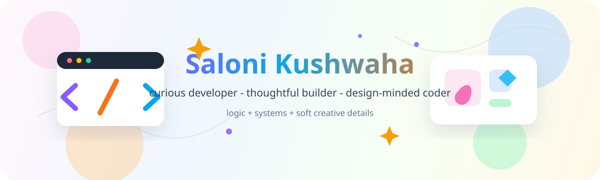

<p align="center">
  
</p>

<p align="center">
  <a href="mailto:ninjaxoninja@gmail.com">
    
  </a>
  
  
</p>

---

## About Me

```js
const saloni = {
  focus: ["logic", "design", "systems"],
  style: "clean, functional, thoughtfully crafted",
  currently: "strengthening foundations while experimenting across domains",
  openTo: ["collaboration", "conversation", "well-built possibilities"]
};
```

I enjoy building things that feel clear, useful, and carefully put together. I like the space where code has structure, design has feeling, and small details make the whole thing easier to understand.

---

## Little Workbench

| Code | Design | Systems |
| --- | --- | --- |
| Writing clean logic | Shaping friendly interfaces | Connecting ideas into working flows |
| Practicing fundamentals | Exploring visual tools | Learning how pieces fit together |
| Building small experiments | Polishing details | Improving one step at a time |

---

## Tech Stack

### Programming & Markup


### Frameworks, Tools & Databases


### Design & Creative


---

## Profile Notes

<p align="center">
  
  
  
</p>

```txt
today's tiny rule:
make it useful
make it kind
make it a little more beautiful than yesterday
```

---

<p align="center">
  Thanks for stopping by. Let's build something thoughtful.
</p>
