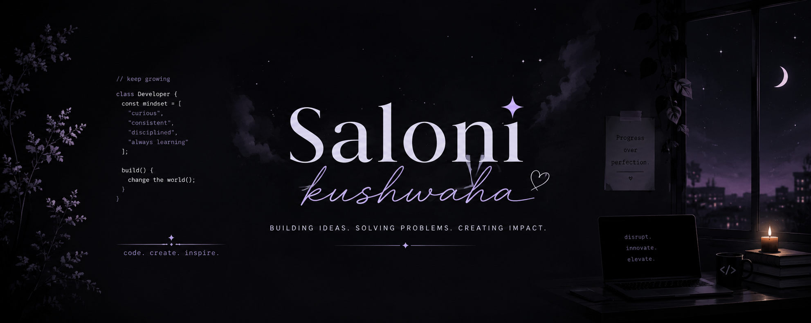

<p align="center">
  
</p>

<p align="center">
  <a href="mailto:ninjaxoninja@gmail.com">
    
  </a>
  
  
</p>

---

## About Me

```js
const saloni = {
  mindset: ["curious", "consistent", "always learning"],
  craft: ["structured logic", "clean interfaces", "quiet details"],
  orbit: ["systems", "patterns", "intelligent tools"],
  motto: "progress over perfection"
};
```

I enjoy building things that feel clear, useful, and carefully put together. I am drawn to the layers beneath the screen, the way ideas become instructions, and the way patterns slowly turn into something that can help people think or create better.

---

## Creative Workbench

| Craft | Curiosity | Direction |
| --- | --- | --- |
| Writing logic that stays readable | Exploring how machines think and move | Building ideas with patience |
| Designing calm, expressive details | Studying patterns across layers | Turning experiments into clarity |
| Making small things better | Learning from every bug and breakthrough | Choosing progress over perfection |

---

## Tech Stack

### Programming & Markup


### Frameworks, Tools & Databases


### Design & Creative


---

## Profile Notes

<p align="center">
  
  
  
</p>

```txt
current frequency:
learn deeply
build patiently
polish the details
leave the work clearer than you found it
```

---

<p align="center">
  Thanks for stopping by. Let's build something thoughtful.
</p>
